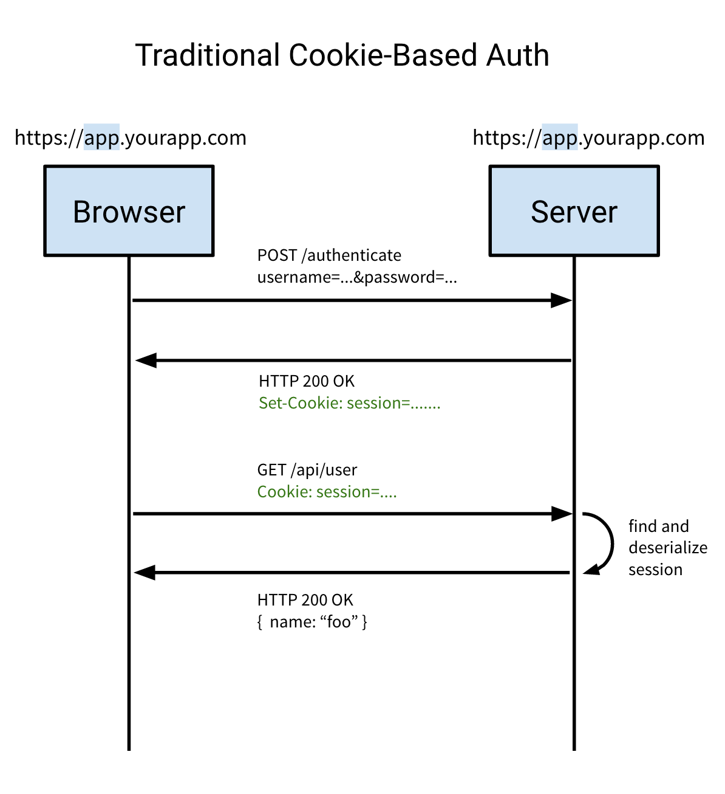

# JWT Authentication with HTTP-Only Cookies

A minimal and secure implementation of User Authentication using **JSON Web Tokens (JWT)** stored in **HTTP-Only Cookies**. This method protects your application against common vulnerabilities like Cross-Site Scripting (XSS) by preventing client-side JavaScript from accessing the token.

---

## 🔄 Authentication Flow

The diagram below illustrates how JWTs are securely exchanged between the client and server using cookies:



1. **Sign Up / Login**: The client submits credentials to the server.
2. **Token Generation & Cookie Storage**: The server validates the user, generates a JWT, and sets it as an `httpOnly` cookie (e.g., `authcookie`).
3. **Authenticated Requests**: For any subsequent requests, the browser automatically attaches the cookie, allowing the server to verify the user.
4. **Logout**: The server clears the cookie, immediately revoking client access.

---

## 🛡️ Security Advantages (Cookie vs. LocalStorage)

| Feature | Cookie (`httpOnly`) | LocalStorage |
| :--- | :--- | :--- |
| **XSS Protection** | ✅ Secure (cannot be read by client-side JS) | ❌ Vulnerable to token theft via script injection |
| **CSRF Risk** | ⚠️ Possible (must be mitigated via CSRF tokens/SameSite settings) | ✅ Immune (must be manually sent in headers) |
| **Ease of Use** | ✅ Automatic (browser handles cookie transmission) | ❌ Manual (must be attached to header via JS) |

---

## 🛠️ Project Setup

### 1. Server (Node.js & Express)
1. Navigate to the server folder:
   ```bash
   cd JWTwithCookieBased/server
   ```
2. Install dependencies:
   ```bash
   npm install
   ```
3. Configure your environment variables by creating a `.env` file:
   ```env
   PORT=3000
   MONGO_URI=your_mongodb_connection_uri
   JWT_SECRET=your_jwt_secret_key
   ```
4. Start the server:
   ```bash
   npm run dev
   ```

### 2. Client (React & Vite)
1. Navigate to the client folder:
   ```bash
   cd JWTwithCookieBased/client
   ```
2. Install dependencies:
   ```bash
   npm install
   ```
3. Create a `.env` file:
   ```env
   VITE_API_URL=http://localhost:3000/api
   ```
4. Start the frontend development server:
   ```bash
   npm run dev
   ```
